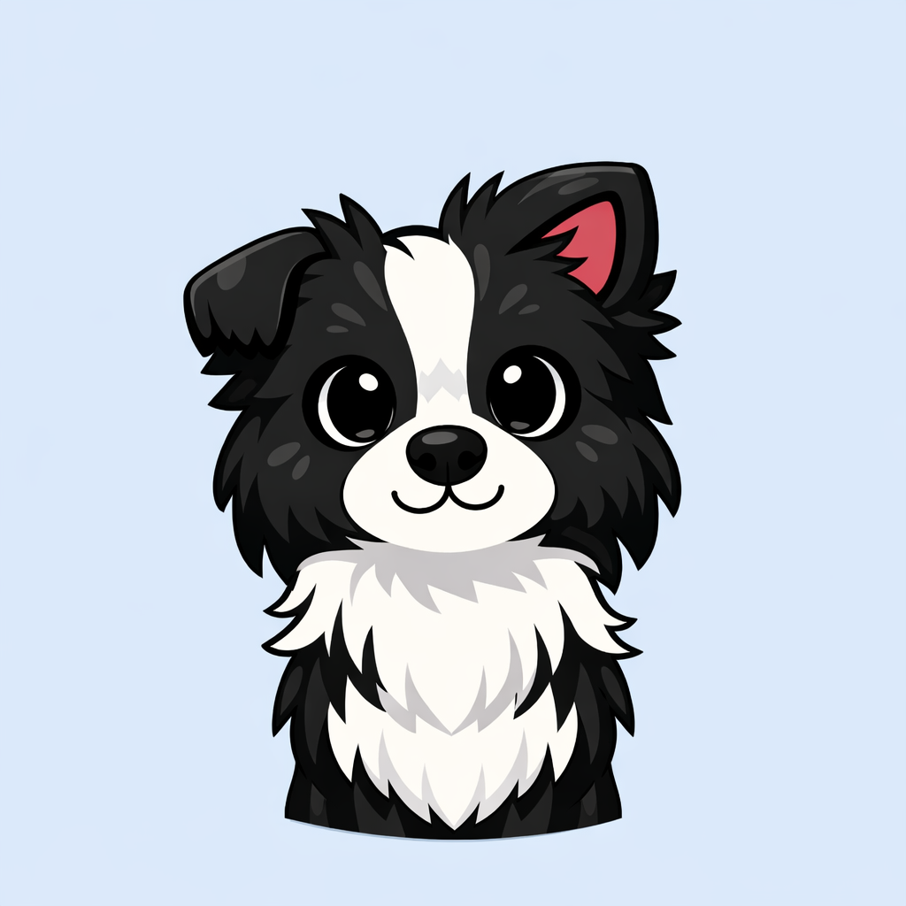

# 👋 Bem-vindo ao Portfólio de Caroline Amancio

<div align="center">


### 💻 Desenvolvedora Full Stack | 🎮 Entusiasta de Tecnologia | 🚀 Inovadora

[](https://github.com)
[](https://linkedin.com)
[](mailto:caroline@email.com)

---

</div>

## 📖 Sobre Mim

Olá! Sou **Caroline Amancio**, uma desenvolvedora apaixonada por tecnologia e inovação. Com experiência em desenvolvimento **web** e **mobile**, estou sempre em busca de novos desafios e oportunidades para crescer.

Meu objetivo é criar soluções elegantes e eficientes que resolvem problemas reais e fazem a diferença na vida das pessoas.

> 💡 *"A tecnologia é melhor quando une criatividade e inovação"*

---

## 🚀 Habilidades Principais

### Frontend Development
```
HTML/CSS        ████████░ 90%
JavaScript      █████████░ 85%
React           ████████░ 80%
Responsive UI   ███████░░ 75%
```

### Backend Development
```
Python          █████████░ 85%
Node.js         ████████░ 80%
Databases       █████████░ 85%
REST APIs       ████████░ 80%
```

### Design & Tools
```
Figma           █████████░ 85%
UI/UX Design    ████████░ 80%
Responsive      ██████████ 90%
Git/GitHub      █████████░ 85%
```

---

## 🎯 Meus Projetos Destaque

### 🎮 Jogo Interativo
> Um jogo web envolvente desenvolvido com JavaScript puro
- ✨ Gráficos incríveis
- 🎮 Jogabilidade fluida
- 📱 Compatível com múltiplos dispositivos
- ⚡ Performance otimizada

**Tecnologias:** JavaScript, HTML5, CSS3  
[🔗 Ver Projeto](#) | [📦 Código-fonte](#)

---

### 📱 App Mobile
> Aplicativo responsivo com React Native
- 📲 Interface intuitiva
- 🚀 Performance em tempo real
- 🔄 Sincronização automática
- 🔐 Segurança de dados

**Tecnologias:** React Native, Firebase, Redux  
[🔗 Ver Projeto](#) | [📦 Código-fonte](#)

---

### 🛒 E-commerce Platform
> Plataforma de comércio eletrônico completa
- 💳 Sistema de pagamento integrado
- 🛒 Carrinho persistente
- 📦 Gerenciamento de estoque
- 🔔 Sistema de notificações

**Tecnologias:** React, Node.js, MongoDB, Stripe  
[🔗 Ver Projeto](#) | [📦 Código-fonte](#)

---

## 🛠️ Stack Tecnológico

### Frontend


### Backend


### Ferramentas


---

## 📊 Estatísticas

<div align="center">

| Métrica | Valor |
|---------|-------|
| 🔧 Projetos Concluídos | 15+ |
| 📚 Linguagens | 6+ |
| ⭐ Repositórios | 50+ |
| 👥 Contribuições | 200+ |
| 🎓 Certificações | 5 |

</div>

---

## 🌱 O Que Estou Aprendendo

- 🤖 Inteligência Artificial e Machine Learning
- ☁️ Cloud Computing (AWS, GCP)
- 🔐 Cibersegurança
- 📊 Data Science
- 🔗 Blockchain

---

## 💼 Experiência Profissional

### Desenvolvedora Full Stack
**Tech Company XYZ** | 2023 - Presente
- Desenvolvimento de aplicações web responsivas
- Otimização de performance e UX
- Mentorado 3 desenvolvedores juniores

### Desenvolvedora Frontend
**StartUp ABC** | 2021 - 2023
- Criação de interfaces modernas e intuitivas
- Implementação de designs em Figma
- Redução de tempo de carregamento em 40%

---

## 🎓 Formação

- **Bacharelado em Ciência da Computação**  
  Universidade XYZ | 2019 - 2023

- **Certificações**
  - AWS Certified Cloud Practitioner
  - Google UX Design Certificate
  - React Advanced Patterns


</div>

---


## 🙏 Agradecimentos

Obrigada por visitar meu portfólio! Se tiver alguma dúvida ou sugestão, não hesite em entrar em contato. 

<div align="center"> 

⭐ Se você gostou, considere deixar uma estrela! ⭐


</div>

---

<div align="center">

**Feito com ❤️ por Caroline Amancio**

© 2026 Todos os direitos reservados.

</div>
